# Alta: Instructivos

## Alta de un nuevo celular
A continuación se detallan los pasos a seguir para dar de alta una licencia en un celular. El alta de un nuevo celular implica instalar las aplicaciones necesarias para que el sistema funcione.

###  Iniciar el celular
Encendemos el celular utilizando el pin **1234**. Veremos la siguiente pantalla:

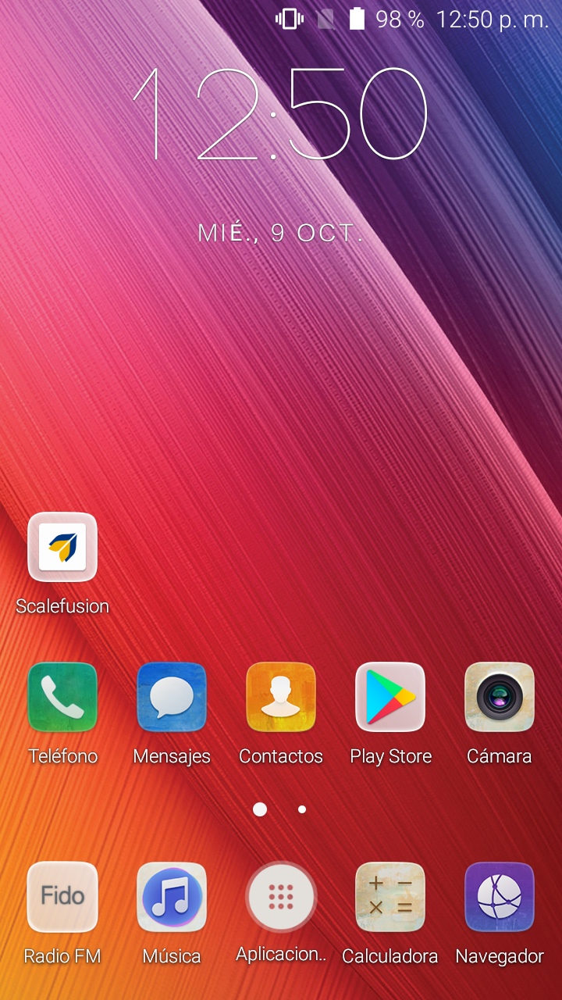

### Conectar el celular Internet
Debemos conectarnos a una red Wi-Fi con Internet. Procedemos como en cualquier celular convencional.

###  Alta de la licencia
1. Abrimos la aplicación Scalefusion

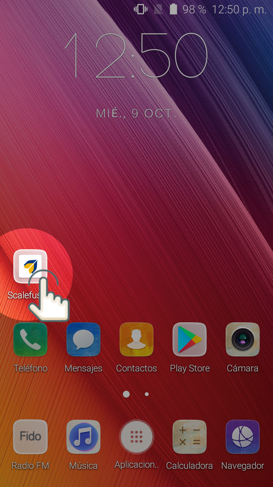

2. Presionamos **Enroll** 

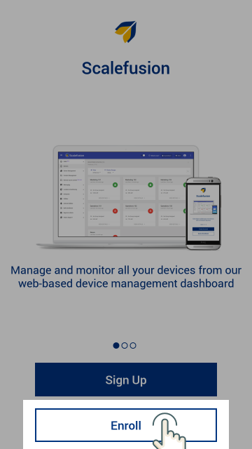

3. Presionamos **Autologin** y luego PERMITIR en aquellos carteles que nos soliciten permisos.

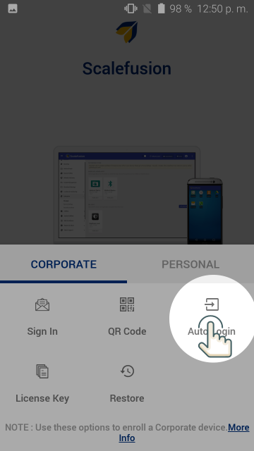
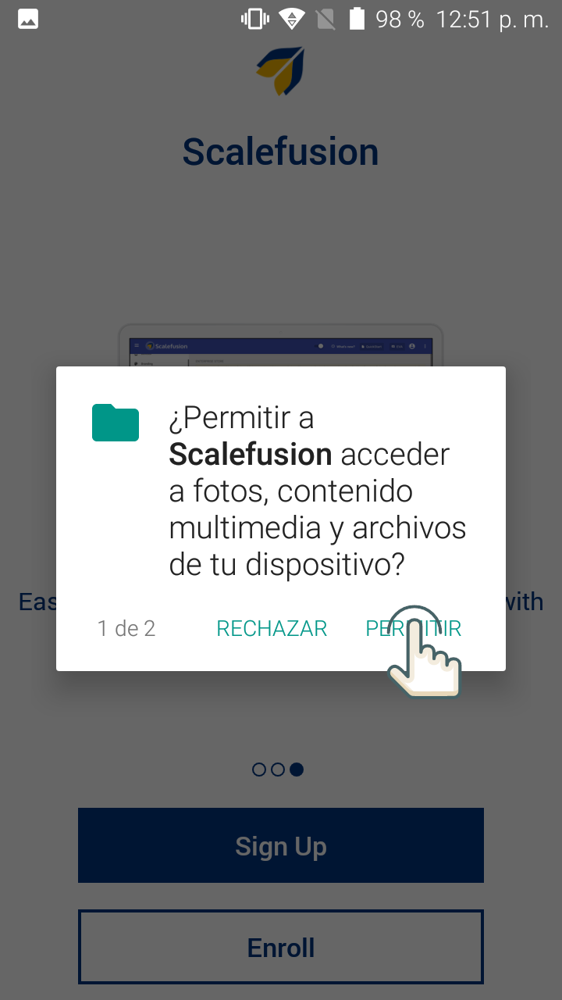

La aplicación carga unos instantes, y nos muestra la siguiente pantalla:

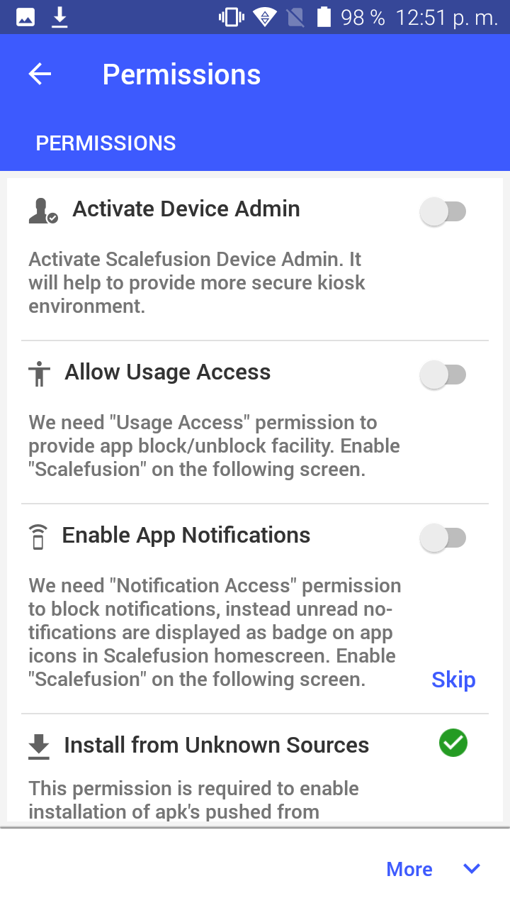

*En caso de dar error aquí, apartar el celular y seguir con otro. Avisarnos luego de todos aquellos que dieron error en este paso.*
 
### Configuración de permisos

1. Siguiendo con el paso anterior, hay que habilitar todos los permisos solicitados:

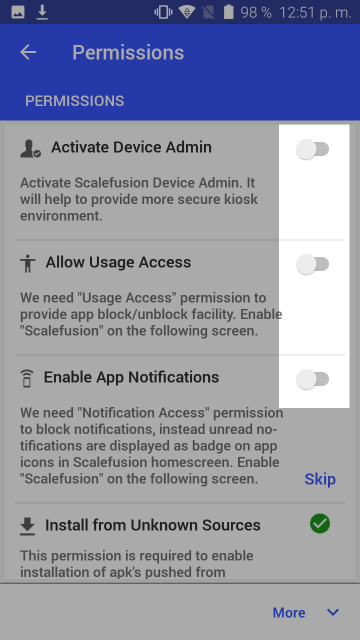

2. Al seleccionar el primero nos aparece la siguiente pantalla:

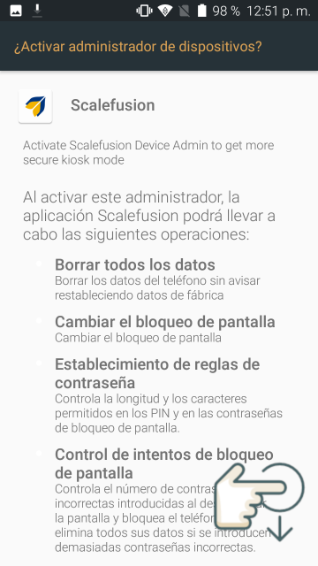

Bajamos y seleccionamos Activar:

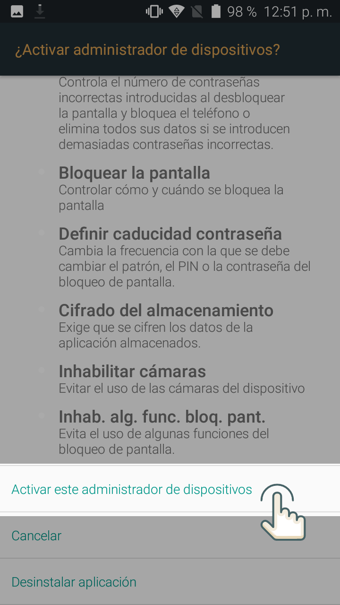

3. En el segundo de los permisos:

Nos aparece la siguiente pantalla:

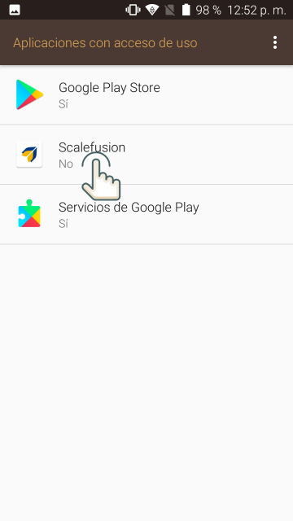

Seleccionamos Scalefusion y habilitamos el permiso.

4. Procedemos con los siguientes permisos según las capturas:

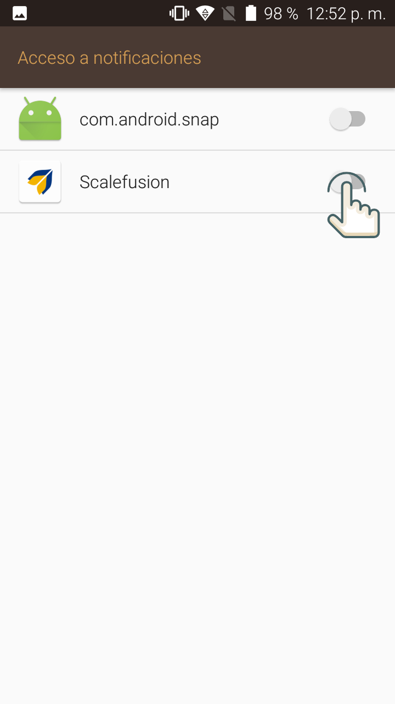
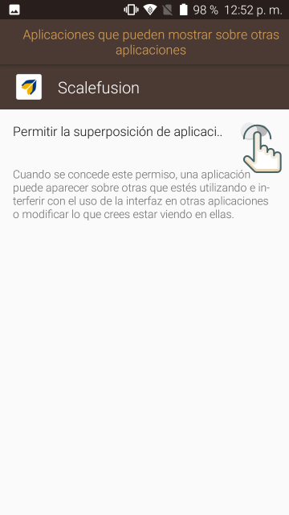
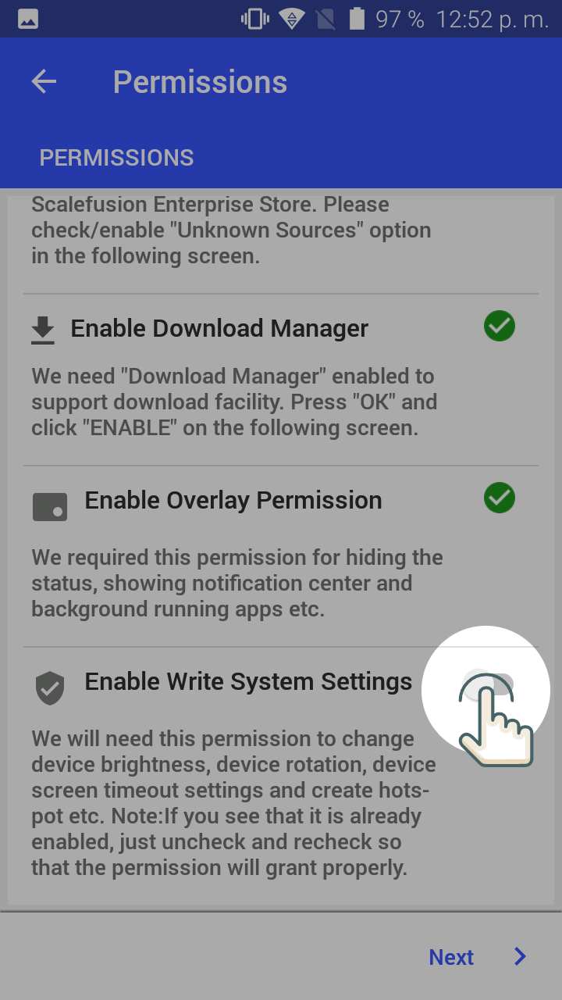
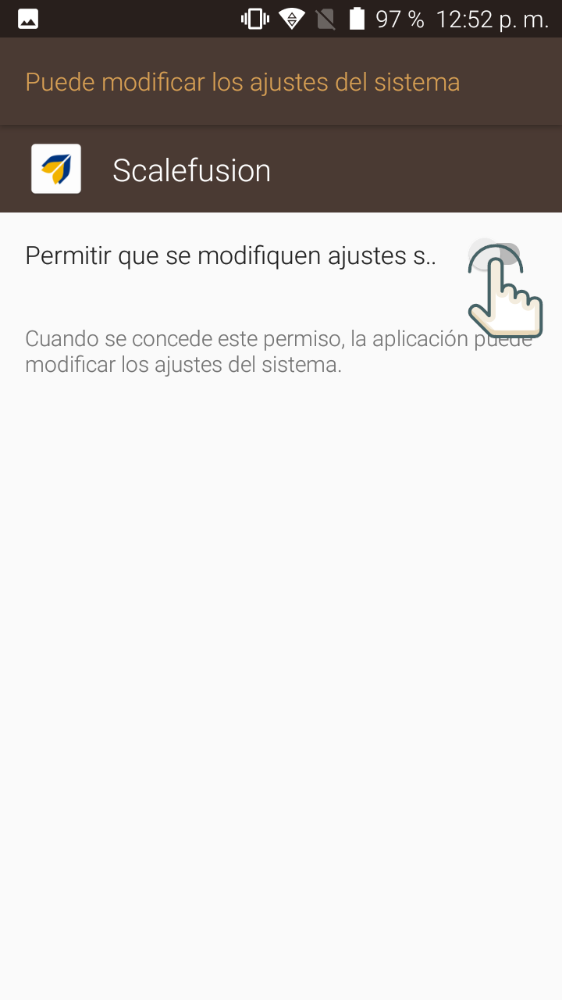

5. Para finalizar con los permisos seleccionamos Next:

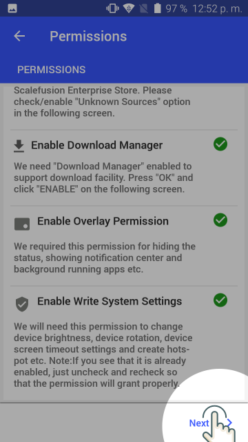

Luego More, y luego presionamos en Grant:

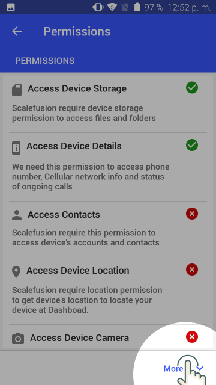
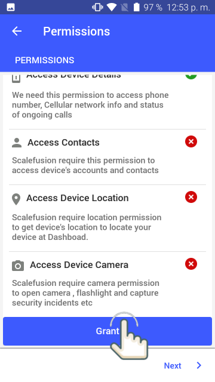

Seleccionamos PERMITIR en todos los carteles:

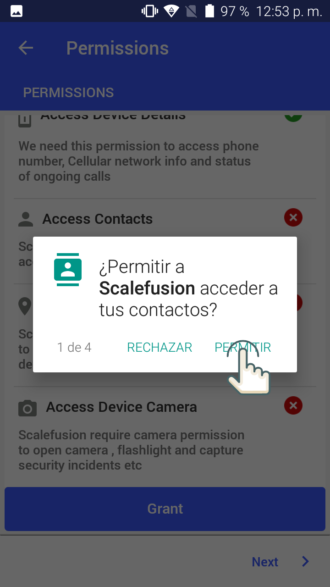

Y para finalizar Next:

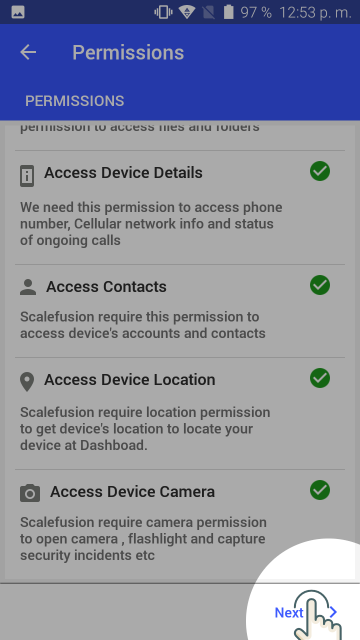

### Instalación de la aplicación Acta Digital
Continuamos según las capturas:

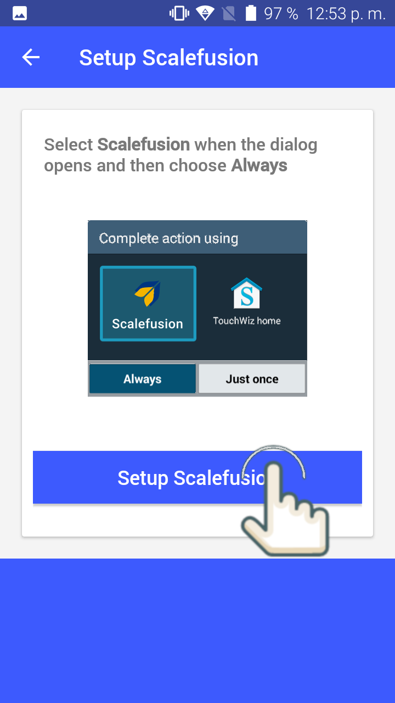
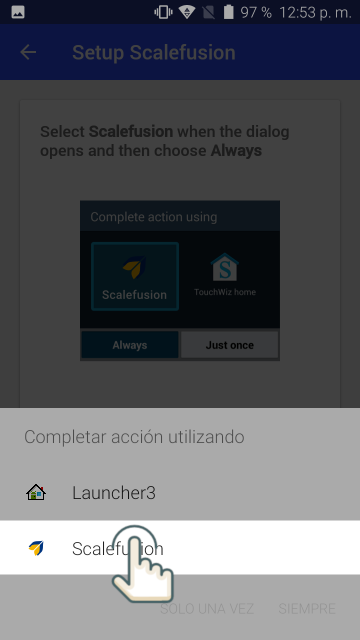

Es muy importante seleccionar **Siempre**

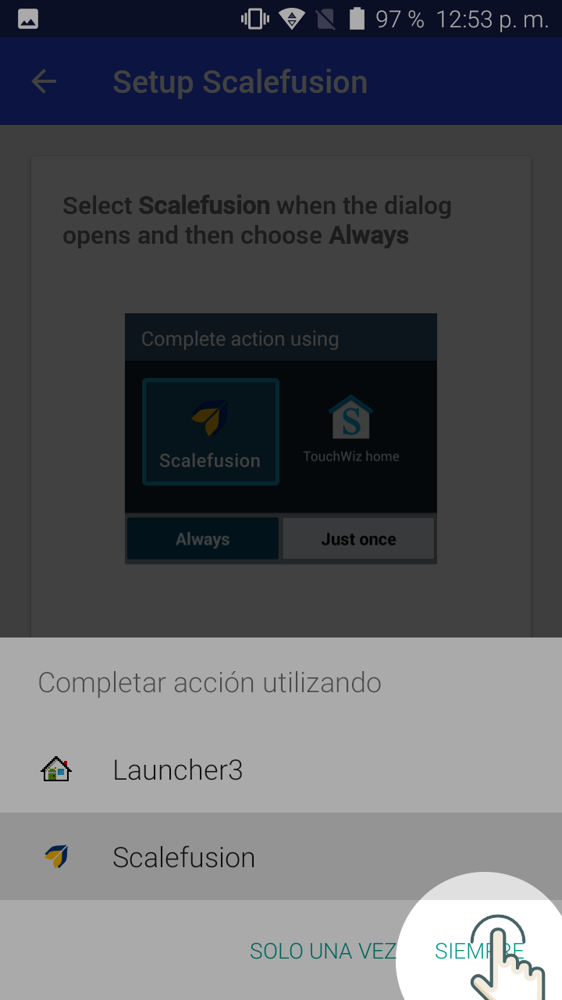

Cuando nos solicite habilitar la ubicación, le damos ACEPTAR:

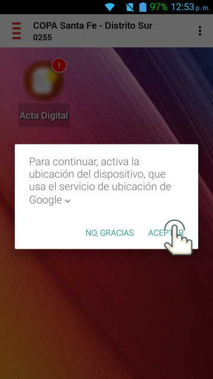

Para finalizar instalamos la aplicación Acta Digital.
Para eso presionamos sobre el icono borroso de la aplicación. Nos aparecerán las siguientes pantallas. Seguimos los pasos:

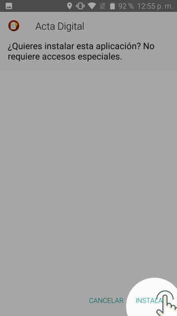
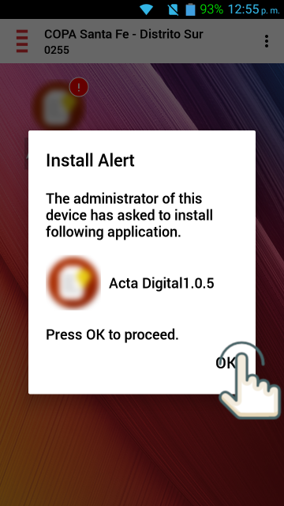
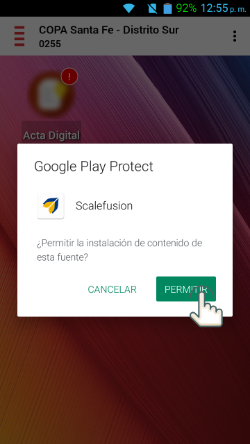

- Autenticar el Sistema con datos de usuario
- Configurar datos del usuario (nombre, apellido, identificador, mail)
- Configurar huella digital
- Configurar wi-fi
