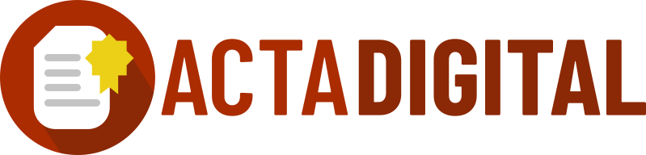
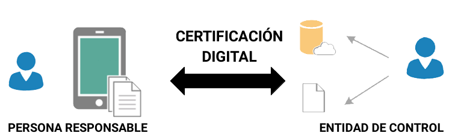

Este sitio concentra toda la documentación de ayuda para usuarios finales (profesionales) y administradores (colegios) del sistema de **Vinculación Electrónica** y todas sus partes.

Recorra la tabla de contenidos o utilice la herramienta de búsqueda para encontrar la solución adecuada a su problema.

Si la documentación no alcanza, siempre puede encontrarnos en nuestro [correo electrónico](info@actadigital.com.ar).

# ¿Qué es **Acta Digital**?

Es un **Sistema de Vinculación Electrónica** de actos, por ejemplo, un _acto de levantamiento parcelario_.

**Vincula** y **valida** datos relacionados a un acto, como pueden ser:

- identidad de la persona responsable del acto
- ubicación geográfica
- fecha y hora

Luego, los aloja en una Base de Datos accesible en _la nube_. Esto facilita su validación, que puede ser automatizada y su accesibilidad para la entidad de control de dichos actos y datos.

