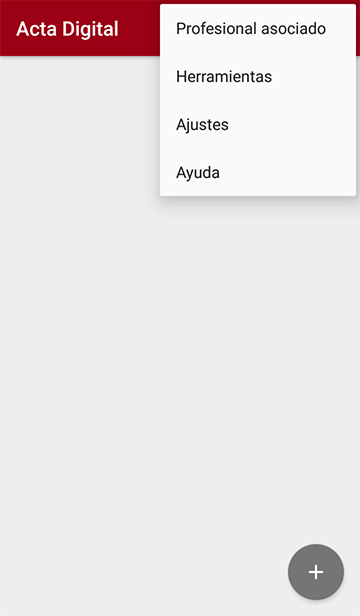
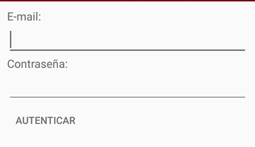
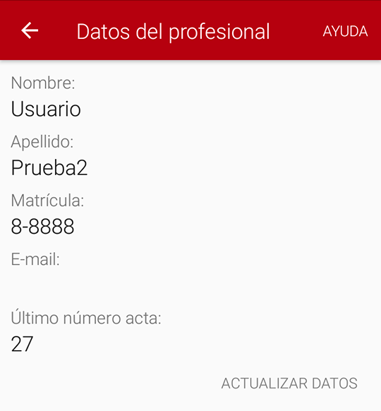

# Instructivo para **Alta de profesional**

A continuación se detallan los pasos a seguir para **asociar un dispositivo a una persona** (profesional responsable). El alta de un nuevo profesional implica configurar el dispositivo con los datos de esa persona, incluyendo el registro de su huella dactilar. Para realizar este instructivo necesitamos estar conectados a una red Wi-Fi ([Conexión a redes Wi-Fi](https://actadigital.readthedocs.io/es/latest/instructivo-app/#conexion-a-redes-wi-fi))

## Abrir la aplicación Acta Digital
Abrimos la aplicación y presionamos los 3 puntitos ubicados en la esquina superior derecha e ingresamos en la opción **Profesional Asociado**.

## Asociamos el dispositivo al profesional
Completamos los campos E-mail y Contraseña correspondientes al profesional.

Luego presionamos en **AUTENTICAR**, aguardamos unos instantes y nos aparecerán en pantalla los datos del profesional.

## Guardar el identificador del dispositivo
En pantalla de inicio del dispositivo vemos un número identificador, en el sector superior izquierdo. 

Anotar dicho número en la planilla entregada con el listado de emails y contraseñas, en la columna *id celular*.

## Registrar la huella dactilar del profesional
Para finalizar el proceso debemos registrar en el dispositivo las huellas dactilares del profesional. Para ello, en la pantalla de inicio del dispositivo (donde vemos el icono de Acta Digital) presionamos los 3 puntitos de la esquina superior derecha y seleccionamos Settings. Ingresamos el codigo de seguridad asignado. Buscamos la opción Open system settings y luego Seguridad. Allí encontraremos las opciones para agregar huellas. Los toques en el sensor (que está en la parte posterior del dispositivo) deben ser suaves y repetidos. Se recomienda registrar el dedo índice de cada mano.