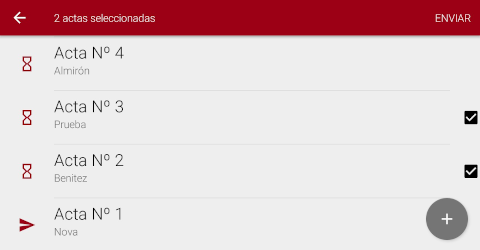

# Instructivo Acta Digital

## Introducción

La aplicación Acta Digital es parte del sistema de **Vinculación Electrónica** de actos. Tiene la finalidad de generar y administrar Actas Digitales desde el celular. Básicamente su funcionalidad es relacionar los siguientes datos a cada acto:

- identidad de la persona responsable
- ubicación geográfica
- fecha y hora

En el caso de, por ejemplo, los agrimensores, dichos actos son _actos de levantamiento parcelario_.

Para ello, cada persona tiene asignada un dispositivo y las acciones que realice con la aplicación Acta Digital son registradas bajo su nombre y responsabilidad.

En los siguientes apartados se describen las principales funcionalidades y se detallan las
instrucciones de uso.

### ¿En qué consiste un Acta Digital?

En el caso de los **profesionales de la agrimensura**, un Acta Digital está compuesta por una serie de datos que hacen referencia a un **acto de levantamiento parcelario**. Los datos son:

- Identificador de parcela (número de partida de impuesto inmobiliario)
- Datos de persona comitente del acto (nombre y apellido)
- Datos de persona ocupante de la parcela (nombre y apellido y calidad de ocupación)
- Observaciones
- Fecha y hora del acto
- Ubicación geográfica del acto (coordenadas latitud y longitud)
- Identidad de la persona responsable del acto (huella dactilar)

#### Estados de un Acta Digital

Un Acta Digital puede encontrarse en uno de estos tres estados:

- Pendiente de envío
- Enviada
- Anulada

El estado **Pendiente** se representa con un ícono de reloj de arena. Un acta se encuentra en estado Pendiente cuando ha sido realizada pero aún no ha sido enviada. Esto significa que el Acta se encuentra alojada sólo en el dispositivo.

Para representar el estado **Enviada** visualmente se emplea un ícono de flecha. Un Acta pasa al estado Enviada cuando ha sido enviada exitosamente. Esto es, pasó a alojarse en la nube para que las entidades interesadas puedan acceder a ella y además Ud. ha recibido una copia al correo electrónico asignado previamente para ello.

Eventualmente, un Acta puede ser anulada. En este caso pasa al estado **Anulada**. Las actas anuladas no pueden enviarse ni editarse.

## Visualización de Actas

Inicialmente el listado de actas se encuentra vacío. A medida que se van creando actas, éstas se muestran listadas en la pantalla inicial de la aplicación.

Cada ítem del listado muestra el número identifocador del Acta, el ícono que representa su estado, y el comitente del Acto. Si presiona sobre un Acta podrá ver más información acerca de la misma.

En la pantalla de detalles se ven los datos que contiene el Acta Digital. A la derecha de las coordenadas, la aplicación presenta un botón (una lupa) para que, en caso de contar con conexión a Internet, se pueda ver sobre un mapa de Google Maps la ubicación de las coordenadas donde fue realizada el Acta.

En la esquina inferior derecha se encuentra el botón de Creación de actas. En la siguiente sección se detalla esta funcionalidad.

## Creación de nueva Acta

La creación de Actas se accede desde el listado de actas, con el botón que se ubica en la parte
inferior derecha de la pantalla. Al presionarlo se abre la siguiente pantalla:

Los pasos son:

- Completar datos del Acta
- Guardar Acta

### Completar datos del Acta

Campos a completar:

- **Partida de Impuesto Inmobiliario** _(obligatorio)_: Número completo de PII. A medida que se ingresan los números, la aplicación va dando el formato apropiado y calcula el dígito de control de API. El dígito de control se muestra a la derecha del número de PII y no debe ingresarse. Se recomienda verificar que sea correcto.

    **_Importante_**: Si la PII se ingresa incorrectamente, **NO** funcionará el control automático de calidad de la misma y puede ocasionar el rechazo d ela misma de parte de las entidades controladoras.

- **Comitente** _(obligatorio)_: Nombre y apellido del comitente.
- **Ocupante** _(obligatorio)_: Nombre y apellido del ocupante, si existe.
- **Calidad de ocupación**: En este campo se despliegan opciones predeterminadas por Catastro. Selecciona la adecuada al caso. En su defecto, podrá seleccionar "Otro" y detalle en el cmapo Observaciones.
- **Nota u observación**: Cualquier aclaración que crea adecuada.

La ubicación (coordenadas latitud y longitud) se obtiene automáticamente y es inmodificable. Mientras ese campo esté vacío, se debe aguardar hasta que la aplicación las obtenga; mientras tanto pueden completarse los restantes datos del Acta.

**_Importante_**: La aplicación solicita al receptor GPS coordenadas cada 10 segundos. Es importante no obstaculizar la visibilidad de satélites GPS del dispositivo (techos, árboles, edificios, etc.). Por favor, lea [estas recomendaciones](recomendaciones.md) para hacer un mejor uso de la aplicación. 

### Guardar Acta

Para guardar el Acta simplemente presione **Guardar Acta**. Si los datos no están completos, la aplicación resalta aquellos campos obligatorios o inválidos. Si todo está bien, al presionar **Guardar Acta**, la aplicación solicita el ingreso de la huella dactilar de la persona asociada a ese dispositivo.

Con sólo tocar el sensor de huellas es suficiente. Una vez reconocida la huella, el Acta se guarda y es posible visualizarla en el [listado de actas](#visualizacion-de-actas).

## Envío de Actas

El envío de actas se realiza desde el listado de las mismas. Seleccione las actas que quiere enviar y luego presione el botón **Enviar**. Para seleccionar un Acta, presione unos
segundos sobre la misma.

*Aquí pueden verse seleccionadas las actas número 2 y 3, y el botón __Enviar__.*

La aplicación solicitará que confirme la operación. Es importante remarcar que **para realizar el envío de las Actas se necesita conexión a Internet**.

Otra opción de envío es enviar _todas_ las actas pendientes, evitando seleccionar una por una. Para ello, no habiendo seleccionado ningún Acta, presione el botón **Enviar actas** ubicado en el menú superior del listado de actas.

*Presionando __Enviar Actas__, serán enviadas todas las actas en Estado Pendiente.*

> Para realizar el envío de las actas se necesita conexión a Internet. Debemos conectar el dispositivo a una red Wi-Fi.

## Uso del dispositivo

### PIN de desbloqueo

El dispositivo suele tener configurado un PIN por defecto que siempre es **1234**. Este código será solicitado cuando encienda el dispositivo. Los siguientes desbloqueos podrán realizarse empleando la huella dactilar o el mismo PIN.

### Conexión a redes wi-fi

Para ver las redes wi-fi disponibles y conectarse a una de ellas, ingrese al menú **Wi-Fi Connection** desde la esquina superior derecha de la pantalla inicial. Luego, en la pantalla **Wi-Fi Settings** active el _Switch Wifi_.

