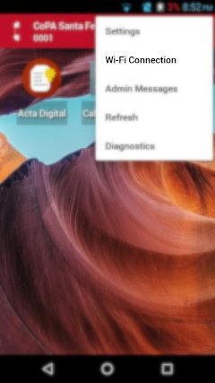
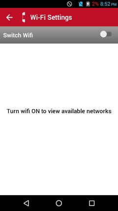

# Preguntas Frecuentes

Aquí dejamos un listado de preguntas frecuentes y la solución a algunos problemas recurrentes, luego de algunos años de experiencia de uso del sistema.

Algunos casos se refieren a un modelos de dispositivo en particular (FiGO, nova, doogee, Blü). Los mismos serán señalados.

Para mayor información, también está disponible el [Instructivo de la aplicación **Acta Digital**](instructivo-app.md) y siempre puede contactarnos a nuestro [correo electrónico](mailto:info@actadigital.com.ar) o a través de la entidad que le haya suministrado el dispositivo.

## PIN de desbloqueo 

!!! info "PIN"
    1234

El dispositivo tiene configurado un PIN por defecto que es **1234**. Por razones de seguridad, la mayoría de los dispositovos lo exigen.

Este código será solicitado cuando encienda el dispositivo. Los siguientes desbloqueos podrán realizarse empleando la huella dactilar o el mismo PIN.

## Pérdida del dispositivo

En el caso extremo de sufrir robo, pérdida o rotura del dispositivo la única manera de proceder es comunicarse con la entidad que se lo haya entregado, con la cual comunmente Ud. firmó un contrato de comodato, para **denunciar la pérdida** del mismo y **solicitar su reposición**.

Por el momento **no existe** una manera de hacer copia de seguridad de las Actas en estado _Pendiente_. Por esto, hacemos énfasis en algunos [usos recomendados](recomendaciones.md) para evitar tener que rehacer dichas Actas en este caso.

## Obtención de Coordenadas

!!! info "El GPS debe funcionar sin Internet"
    La obtención de coordenadas **debe funcionar** con GPS, sin necesidad de acceso a internet. Aunque la conexión puede agilizar y mejorar este proceso.

Como todo receptor GPS, el dispositivo debe tener _buena visibilidad_. Esto significa que **el cielo debe estar libre de todo obstáculo**. Árboles, edificios, techos, son ejemplos de obstáculos que deberá evitar.

Una buena alternativa en casos complicados es **acceder a internet compartiendo datos desde otro dispositivo**, y así asistir al receptor GPS con la triangulación que el dispositivo puede calcular con las redes de datos móviles. Por favor, lea [estas recomendaciones](recomendaciones.md#compartir-datos-desde-otro-dispositivo).

!!! warning "Problemas con dispositivo FiGO"
    Si la obtención de coordenadas demora demasiado (varios minutos) aunque esté a cielo abierto, suele funcionar **cancelar el Acta y volver a crearla**.

## Conexión a redes wi-fi

Para ver las redes wi-fi disponibles y conectarse a una de ellas, ingrese al menú **Wi-Fi Connection** desde la esquina superior derecha de la pantalla inicial. Luego, en la pantalla **Wi-Fi Settings** active el _Switch Wifi_.

## Fecha y hora

!!! danger "Software desactualizado"
    Suele pasar que el reloj del dispositivo _se desconfigure_. Las razones pueden ser **software desactualizado** o **desincronización por falta de conexión a internet**, igual que sucede con cualquier dispositivo móvil.

Para evitar la _desconfiguración_ del reloj del dispositivo, se **recomienda fuertemente conectar el dispositivo a internet con cierta frecuencia**. Al menos mensualmente. Esto no solo evitará _desconfiguraciones_, sino también mantendrá las piezas de software actualizadas, lo cual a su vez ayudará a evitar otros varios problemas de mal funcionamiento o _desconfiguración_.

Para acceder a internet, puede hacerlo conectándose a una red wi-fi o [compartiendo datos desde otro dispositivo](recomendaciones.md#compartir-datos-desde-otro-dispositivo)

## Pantalla táctil descalibrada

Algunos dispositivos de la marca FiGO han sufrido este problema. La pantalla pierde _calibración_. Es decir, cuando se presiona sobre un punto de la misma, el dispositivo lo toma en otro. Esto ocasiona que cuando se quiere presionar un botón, se termina presionando otro y todo redunda en un mal funcionamiento.

Por ahora no existe otra solución que el **cambio del dispositivo por uno nuevo**. Para ello, por favor comunicarse con la entidad que se lo entregó para disparar el protocolo de cambio.

## Problemas con la batería

Algunos dispositivos de la marca FiGO han sufrido problemas con la batería:

- poca durabilidad
- se apaga de repente
- nunca llega a cargarse al 100%

Todos estos indicadores se refieren a una **batería _descalibrada_**.

Si la batería está mal calibrada, es posible que el dispositivo esté mostrando porcentajes erróneos y termine apagándose inesperadamente. Además, también puede ser las distintas componentes de hardware y software se vean afectadas en su normal funcionamiento.

### Calibración de la batería

Un método general que se aplicar con cualquier dispositivo independientemente de su marca es el siguiente:

1. Cargar la batería por completo. Enchufar y esperar hasta que el indicador de la batería cargue al 100% (aunque si está descalibrada, puede pasar que se quede en un número menor). No desenchufar inmediatamente cuando alcance ese tope de carga, sino dejarlo un poco más para asegurarse de que si está descalibrada no afecte al límite superior de la carga.
2. Descargar la batería por completo. No importa cómo, el objetivo es descargarlo por completo forzando que se apague solo. Por ejemplo, subir el brillo al máximo.
3. Dejar reposar al menos 4 horas antes de ponerlo a cargar nuevamente. La batería puede tener un exceso residual de carga que provoca el descalibrado, y durante estas horas de reposo cuando la batería queda descargada por completo, este exceso debería ser liberado por la propia batería.
4. Volver a cargar al 100% de carga y luego dejarlo un rato más para asegurarte de que se quede totalmente cargado.
5. Ya debería estar calibrado y se debería poder utilizar sin problemas. Este proceso puede repetirse si el problema vuelve a surgir algún tiempo después.
